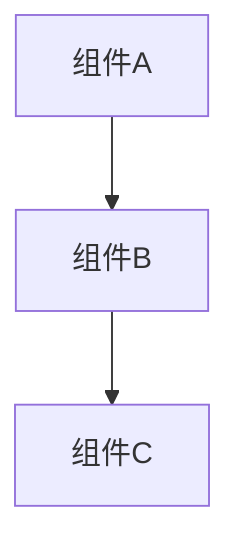

# Nexus CLI - 智能任务路由器 (v1.0.0)

执行任务：{{prompt}}

## 🔴🔴 强制性约束 (MANDATORY) - 最高优先级

**以下约束绝对生效，无一例外：**

| 约束 ID | 规则 | 违规行为 |
|---------|------|----------|
| `FORCE_PAL_CHECK` | **必须**在开始前检查 PAL MCP 可用性，不可用时询问用户是否降级 | 不检查 PAL 直接分配 Gemini/Codex 任务 |
| `FORCE_SPEC_FIRST` | **必须**在执行前完成 Spec 流程（除非使用 --skip-spec） | 不生成 spec 文档就开始任务执行 |
| `FORCE_SPEC_USER_APPROVAL` | **必须**在每个 Spec 阶段使用 AskUserQuestion 获取用户确认 | 不询问用户直接进入下一阶段 |
| `FORCE_ATOMIC_TASKS` | **必须**将任务拆分为原子操作（≤5分钟） | 创建粗粒度的大任务 |
| `FORCE_BATCH_GROUPING` | **必须**按依赖关系将任务分组为执行批次 | 不分批次一次性执行所有任务 |
| `FORCE_BATCH_TODOWRITE` | 每个批次完成后**必须**立即更新 TodoWrite | 等待所有批次完成才更新 |
| `FORCE_USER_CONFIRMATION` | **必须**在执行前使用 AskUserQuestion 获取用户确认 | 不询问用户直接选择执行器 |
| `FORCE_CORRECT_TOOL` | Gemini/Codex 任务**必须**使用 `mcp__pal__clink`，**禁止**使用 Task tool | 选择 Gemini/Codex 但使用 Task tool 执行 |

### ⚠️ 违规检测自检

在执行任何操作前，必须自检：
0. ✅ **我是否已经检查 PAL MCP 可用性？**（如果没有，**立即执行阶段 0**）
1. ✅ 我是否已经完成 Spec 流程或用户使用了 --skip-spec？（如果没有，**立即开始 Spec 流程**）
2. ✅ 我是否已经调用了 TodoWrite 工具？（如果没有，**立即调用**）
3. ✅ 我是否已经使用 AskUserQuestion 获取用户对执行器的确认？（如果没有，**禁止执行任务**）
4. ✅ 任务是否已拆分为原子操作（≤5分钟）？
5. ✅ 任务是否已按依赖关系分组为批次？
6. ✅ **Gemini/Codex 任务是否使用 `mcp__pal__clink` 调用？**（如果使用 Task tool，**立即停止并改用 clink**）

---

## 🔴 阶段 0: PAL MCP 可用性检查 (最优先执行)

**此阶段必须在任何其他操作之前执行！**

### 步骤 0.1: 检测 PAL MCP

通过尝试调用 `mcp__pal__listmodels` 检测 PAL MCP 是否可用：

```
尝试调用: mcp__pal__listmodels({})

如果成功 → PAL MCP 可用，设置 PAL_AVAILABLE = true
如果失败/超时/工具不存在 → PAL MCP 不可用，设置 PAL_AVAILABLE = false
```

### 步骤 0.2: 处理不可用情况

**如果 PAL MCP 不可用**，**必须**使用 AskUserQuestion 询问用户：

```
AskUserQuestion({
  questions: [{
    header: "PAL MCP 检测",
    question: "检测到 PAL MCP 不可用，无法调用 Gemini/Codex CLI。请选择处理方式：",
    options: [
      {label: "降级到 Claude 模式", description: "所有任务由 Claude Code 子代理处理（功能完整但无 Gemini/Codex 优势）"},
      {label: "取消执行", description: "中止 Nexus 流程，先配置 PAL MCP"}
    ],
    multiSelect: false
  }]
})
```

**处理逻辑**:
- 如果用户选择"降级到 Claude 模式" → 设置 `CLAUDE_ONLY_MODE = true`，继续执行
- 如果用户选择"取消执行" → 输出配置指南并终止

### 步骤 0.3: Claude-Only 模式影响

当 `CLAUDE_ONLY_MODE = true` 时：

| 原执行器 | 降级后 | 使用工具 |
|---------|--------|----------|
| 🧠 Claude | 🧠 Claude | Task tool (subagent) |
| 💎 Gemini | 🧠 Claude | Task tool (subagent) |
| 🔷 Codex | 🧠 Claude | Task tool (subagent) |

**子代理类型映射**:
- 原 Gemini (前端) → `frontend-architect` 或 `general-purpose`
- 原 Codex (后端) → `backend-architect` 或 `general-purpose`

### PAL MCP 配置指南（取消执行时显示）

```
PAL MCP 配置指南：

1. 确认 PAL MCP 服务器已安装并运行
2. 在 ~/.claude.json 中添加 PAL MCP 配置：

{
  "mcpServers": {
    "pal": {
      "command": "...",
      "args": ["..."]
    }
  }
}

3. 重启 Claude Code 使配置生效
4. 重新运行 /nexus 命令
```

---

### 🔴 工具调用强制映射

**绝对禁止混用工具！执行器与工具的映射关系如下：**

| 执行器 | 必须使用的工具 | 禁止使用的工具 |
|--------|---------------|---------------|
| 🧠 Claude | `Task` tool (subagent) | - |
| 💎 Gemini | `mcp__pal__clink` (`cli_name: "gemini"`) | ❌ Task tool |
| 🔷 Codex | `mcp__pal__clink` (`cli_name: "codex"`) | ❌ Task tool |

**正确调用示例**：
```
// ✅ 正确：Codex 任务使用 clink
mcp__pal__clink({
  "prompt": "实现用户登录 API",
  "cli_name": "codex"
})

// ✅ 正确：Gemini 任务使用 clink
mcp__pal__clink({
  "prompt": "创建登录表单组件",
  "cli_name": "gemini"
})

// ❌ 错误：Codex 任务使用 Task tool（这会用 Claude 执行！）
Task({
  "prompt": "实现用户登录 API",
  "subagent_type": "backend-architect"  // 这是 Claude，不是 Codex！
})
```

**违规检测**：如果你发现自己在 Gemini/Codex 任务中调用了 `Task` tool，**立即停止**并改用 `mcp__pal__clink`！

---

## 完整执行流程

```
┌─────────────────────────────────────────────────────────────┐
│              阶段 0: PAL MCP 可用性检查 (最优先)              │
├─────────────────────────────────────────────────────────────┤
│  检测 PAL MCP → 可用: 正常模式 / 不可用: 询问降级            │
│  ├─ 降级到 Claude 模式 → CLAUDE_ONLY_MODE = true            │
│  └─ 取消执行 → 显示配置指南并终止                           │
└─────────────────────────────────────────────────────────────┘
                              ↓
┌─────────────────────────────────────────────────────────────┐
│                    SPEC 流程 (阶段 1 到 3)                    │
├─────────────────────────────────────────────────────────────┤
│  阶段 1: 需求收集 → requirements.md → 用户确认               │
│  阶段 2: 设计文档 → design.md → 用户确认                     │
│  阶段 3: 实施计划 → tasks.md (批次格式) → 用户确认           │
└─────────────────────────────────────────────────────────────┘
                              ↓
┌─────────────────────────────────────────────────────────────┐
│                   NEXUS 执行流程 (阶段 4 到 5)                │
├─────────────────────────────────────────────────────────────┤
│  阶段 4: TodoWrite 初始化 + 用户确认执行器                   │
│  阶段 5: 批次执行循环                                        │
│         ┌─────────────────────────────────────────┐          │
│         │  For each 批次:                         │          │
│         │    ├─ 并行执行批次内所有任务            │          │
│         │    │   ├─ Claude → Task tool            │          │
│         │    │   └─ Gemini/Codex → PAL clink      │          │
│         │    │      (CLAUDE_ONLY: 全部 Task tool) │          │
│         │    ├─ 等待批次完成                      │          │
│         │    ├─ 立即更新 TodoWrite ✅              │          │
│         │    └─ [per_batch 策略] 质量门控检查      │          │
│         └─────────────────────────────────────────┘          │
└─────────────────────────────────────────────────────────────┘
                              ↓
┌─────────────────────────────────────────────────────────────┐
│              质量门控阶段 (阶段 6 - 可配置)                   │
├─────────────────────────────────────────────────────────────┤
│  策略选择（配置文件 .nexus-config.yaml）:                    │
│  ├─ per_batch: 每个批次后执行                               │
│  ├─ on_complete: 所有批次完成后执行（默认）                 │
│  └─ manual: 仅手动触发                                      │
│                                                             │
│  步骤 6.1: 询问是否运行质量门控                             │
│  步骤 6.2: AI 代码审查 → PAL 智能审查                       │
│  步骤 6.3: 门控结果汇总                                     │
└─────────────────────────────────────────────────────────────┘
                              ↓
┌─────────────────────────────────────────────────────────────┐
│                   完成后选项 (阶段 7 - 可选)                  │
├─────────────────────────────────────────────────────────────┤
│  步骤 7.1: 验收确认                                         │
│  步骤 7.2: 询问文档生成 → 用户确认 → 生成更改文档            │
└─────────────────────────────────────────────────────────────┘
```

---

# 第一部分: SPEC 流程

## 🔴 阶段 1: 需求收集 (Requirements Gathering)

**目标**: 基于用户的任务描述生成 EARS 格式需求文档

### 步骤 1.1: 初始化 Spec 目录

首先，根据任务描述生成功能名称（kebab-case），创建 spec 目录：

```bash
# 生成功能名称（将任务描述转换为 kebab-case）
FEATURE_NAME="[根据任务描述生成的功能名称]"
SPEC_DIR=".claude/specs/$FEATURE_NAME"

# 创建目录
mkdir -p "$SPEC_DIR"
```

### 步骤 1.2: 生成 requirements.md

**必须**基于用户的粗略想法生成初始版本的需求文档，而不是先询问连续问题。

**requirements.md 模板**:

```markdown
# [功能名称] - 需求文档

## 功能概述

[基于用户任务描述的功能总结]

---

## 需求列表

### REQ-1: [需求标题]

**用户故事**: 作为[角色]，我想要[功能]，这样[好处]。

**验收标准 (EARS 格式)**:

1. **REQ-1.1** [Ubiquitous]: 系统**应当**[行为描述]。
2. **REQ-1.2** [State-driven]: 当[条件]时，系统**应当**[行为]。
3. **REQ-1.3** [Event-driven]: 当[事件]发生后，系统**应当**[行为]。
4. **REQ-1.4** [Unwanted behavior]: 系统**不应当**[禁止的行为]。
5. **REQ-1.5** [Optional]: 如果[条件]，系统**可以**[可选行为]。

### REQ-2: [需求标题]
...

---

## 边缘情况

1. **EC-1**: [边缘情况描述] - [处理方式]
2. **EC-2**: [边缘情况描述] - [处理方式]

---

## 技术约束

1. **TC-1**: [技术约束描述]
2. **TC-2**: [技术约束描述]

---

## 成功标准

1. **SC-1**: [可衡量的成功标准]
2. **SC-2**: [可衡量的成功标准]
```

### 步骤 1.3: 用户确认

**必须**使用 AskUserQuestion 工具征求用户确认：

```
AskUserQuestion({
  questions: [{
    header: "需求审核",
    question: "需求文档已创建在 .claude/specs/[功能名称]/requirements.md。需求看起来不错吗？如果是的话，我们可以继续进行设计。",
    options: [
      {label: "是，继续设计", description: "需求文档符合预期，继续创建设计文档"},
      {label: "需要修改", description: "有一些需求需要调整或补充"},
      {label: "完全重写", description: "需求理解有偏差，需要重新讨论"}
    ],
    multiSelect: false
  }]
})
```

**确认逻辑**:
- 如果用户选择"是，继续设计" → 进入阶段 2
- 如果用户选择"需要修改" → 根据用户反馈修改 requirements.md，然后重新确认
- 如果用户选择"完全重写" → 与用户讨论，重新生成 requirements.md

⚠️ **在收到明确批准之前，禁止进入阶段 2！**

---

## 🔴 阶段 2: 设计文档创建 (Design Document Creation)

**前置条件**: 用户已明确批准需求文档

**目标**: 基于需求创建详细设计文档

### 步骤 2.1: 生成 design.md

**design.md 模板**:

```markdown
# [功能名称] - 设计文档

## 概述

[基于需求文档的设计总结]

### 设计目标

1. [目标1]
2. [目标2]
3. [目标3]

---

## 架构

### 整体架构

[使用 Mermaid 图表展示架构]



### 组件说明

| 组件 | 职责 | 依赖 |
|------|------|------|
| 组件A | [职责描述] | [依赖列表] |
| 组件B | [职责描述] | [依赖列表] |

---

## 组件和接口

### 1. [组件名称]

**职责**: [组件职责描述]

**接口定义**:

```python
class ComponentName:
    def method_name(self, param: Type) -> ReturnType:
        """
        方法描述

        Args:
            param: 参数说明

        Returns:
            返回值说明
        """
        pass
```

---

## 数据模型

### 1. [数据模型名称]

```json
{
  "field1": "类型和说明",
  "field2": "类型和说明"
}
```

---

## 错误处理

| 错误类型 | 处理方式 |
|---------|---------|
| [错误类型1] | [处理方式] |
| [错误类型2] | [处理方式] |

---

## 测试策略

### 单元测试

| 测试用例 | 描述 |
|---------|------|
| [测试名称] | [测试描述] |

### 集成测试

| 测试用例 | 描述 |
|---------|------|
| [测试名称] | [测试描述] |
```

### 步骤 2.2: 用户确认

**必须**使用 AskUserQuestion 工具征求用户确认：

```
AskUserQuestion({
  questions: [{
    header: "设计审核",
    question: "设计文档已创建在 .claude/specs/[功能名称]/design.md。设计看起来不错吗？如果是的话，我们可以继续进行实施计划。",
    options: [
      {label: "是，继续任务", description: "设计文档符合预期，继续创建实施计划"},
      {label: "需要修改", description: "有一些设计需要调整"},
      {label: "返回需求", description: "需要先修改需求文档"}
    ],
    multiSelect: false
  }]
})
```

**确认逻辑**:
- 如果用户选择"是，继续任务" → 进入阶段 3
- 如果用户选择"需要修改" → 根据用户反馈修改 design.md，然后重新确认
- 如果用户选择"返回需求" → 返回阶段 1 修改需求

⚠️ **在收到明确批准之前，禁止进入阶段 3！**

---

## 🔴 阶段 3: 实施计划 (Implementation Planning)

**前置条件**: 用户已明确批准设计文档

**目标**: 创建原子化任务清单，按批次分组

### 步骤 3.1: 生成 tasks.md（批次格式）

**tasks.md 模板 (v4.0.0 批次格式)**:

```markdown
# [功能名称] - 实施任务清单

## 概述

基于需求和设计文档的原子化任务列表，按执行批次分组。

---

## 批次 1: [批次名称]（串行依赖）

| ID | 任务 | 执行器 | 预估 | 依赖 | 输出文件 |
|----|------|--------|------|------|----------|
| 1.1 | [原子任务描述] | Claude/Gemini/Codex | ≤5min | - | [文件路径] |
| 1.2 | [原子任务描述] | Claude/Gemini/Codex | ≤5min | 1.1 | [文件路径] |

**批次完成标准**: [验证方式]

---

## 批次 2: [批次名称]（可并行）

| ID | 任务 | 执行器 | 预估 | 依赖 | 输出文件 |
|----|------|--------|------|------|----------|
| 2.1 | [原子任务描述] | Claude/Gemini/Codex | ≤5min | 1.2 | [文件路径] |
| 2.2 | [原子任务描述] | Claude/Gemini/Codex | ≤5min | 1.2 | [文件路径] |
| 2.3 | [原子任务描述] | Claude/Gemini/Codex | ≤5min | 1.2 | [文件路径] |

**批次完成标准**: [验证方式]

---

## 批次 3: [批次名称]（可并行）

| ID | 任务 | 执行器 | 预估 | 依赖 | 输出文件 |
|----|------|--------|------|------|----------|
| 3.1 | [原子任务描述] | Claude/Gemini/Codex | ≤5min | 2.1 | [文件路径] |
| 3.2 | [原子任务描述] | Claude/Gemini/Codex | ≤5min | 2.2 | [文件路径] |

**批次完成标准**: [验证方式]

---

## 执行策略

### 批次执行顺序

```
批次 1 (串行) → 批次 2 (并行) → 批次 3 (并行)
```

### 预估时间

| 批次 | 任务数 | 并行度 | 预估时间 |
|------|--------|--------|----------|
| 批次 1 | 2 | 串行 | 10min |
| 批次 2 | 3 | 并行 | 5min |
| 批次 3 | 2 | 并行 | 5min |
| **总计** | **7** | - | **20min** |
```

**原子任务要求**:
- 每个任务 ≤ 5 分钟
- 每个任务必须独立可验证
- 每个任务必须有明确的输出文件

**执行器选择参考**:
- `Claude`: 架构设计、代码审查、复杂分析
- `Gemini`: 前端 UI、算法实现、Web 搜索
- `Codex`: 后端 API、数据库、服务端逻辑

### 步骤 3.2: 用户确认

**必须**使用 AskUserQuestion 工具征求用户确认：

```
AskUserQuestion({
  questions: [{
    header: "任务审核",
    question: "任务清单已创建在 .claude/specs/[功能名称]/tasks.md。任务看起来不错吗？如果是的话，我们可以开始执行。",
    options: [
      {label: "是，开始执行", description: "任务规划合理，开始 Nexus 执行流程"},
      {label: "需要修改", description: "有一些任务需要调整"},
      {label: "返回设计", description: "需要先修改设计文档"}
    ],
    multiSelect: false
  }]
})
```

**确认逻辑**:
- 如果用户选择"是，开始执行" → 进入阶段 4（Nexus 执行流程）
- 如果用户选择"需要修改" → 根据用户反馈修改 tasks.md，然后重新确认
- 如果用户选择"返回设计" → 返回阶段 2 修改设计

⚠️ **在收到明确批准之前，禁止进入阶段 4！**

---

## --skip-spec 标志

如果用户使用 `--skip-spec` 标志，可以跳过 Spec 流程直接进入 Nexus 执行：

```
/sc:nexus --skip-spec 创建用户登录功能
```

**跳过条件**:
- 用户显式使用 `--skip-spec` 标志
- 或任务复杂度 < 0.3 且用户确认跳过

**即使跳过 Spec 流程**，仍必须遵循 `FORCE_USER_CONFIRMATION` 约束！

---

# 第二部分: NEXUS 执行流程

## 🔴 阶段 4: 初始化与用户确认

### 步骤 4.1: 调用 TodoWrite 工具

如果来自 Spec 流程，使用 tasks.md 中的批次任务列表：

```
TodoWrite([
  {content: "Spec 阶段: 需求收集", status: "completed", activeForm: "需求收集已完成"},
  {content: "Spec 阶段: 设计文档", status: "completed", activeForm: "设计文档已完成"},
  {content: "Spec 阶段: 实施计划", status: "completed", activeForm: "实施计划已完成"},
  {content: "批次 1: [批次名称]", status: "pending", activeForm: "等待执行批次 1"},
  {content: "批次 2: [批次名称]", status: "pending", activeForm: "等待执行批次 2"},
  {content: "批次 3: [批次名称]", status: "pending", activeForm: "等待执行批次 3"}
])
```

如果跳过 Spec 流程，先进行任务分析并创建批次：

```
TodoWrite([
  {content: "任务分析与批次规划", status: "in_progress", activeForm: "正在分析任务"},
  {content: "批次执行", status: "pending", activeForm: "等待执行批次"},
  {content: "验收测试", status: "pending", activeForm: "等待验收"}
])
```

### 步骤 4.2: 用户确认执行器

**必须**使用 AskUserQuestion 工具征求用户确认：

```
AskUserQuestion({
  questions: [{
    header: "执行器确认",
    question: "AI 分析建议的执行计划如下。是否同意开始执行？\n\n[展示批次和执行器分配]",
    options: [
      {label: "是，开始执行", description: "同意执行计划，开始批次执行"},
      {label: "调整执行器", description: "需要修改某些任务的执行器分配"},
      {label: "取消执行", description: "暂不执行，返回修改"}
    ],
    multiSelect: false
  }]
})
```

⚠️ **如果跳过此步骤，则违反 FORCE_USER_CONFIRMATION 约束！后续执行将被拒绝！**

---

## 🔴 阶段 5: 批次执行循环（核心）

**这是 v4.0.0 的核心改进：批次化执行 + 即时 TodoWrite 更新**

### 执行流程

```python
# 伪代码：批次执行循环
for batch in batches:
    # 1. 标记批次开始
    update_todowrite(batch, "in_progress")

    # 2. 并行执行批次内所有任务
    results = parallel_execute(batch.tasks)
    # - Claude 任务 → Task tool
    # - Gemini/Codex 任务 → PAL MCP clink

    # 3. 等待批次完成
    wait_for_completion(results)

    # 4. 立即更新 TodoWrite
    update_todowrite(batch, "completed")

    # 5. 验证批次完成标准
    verify_batch_criteria(batch)
```

### PAL MCP clink 调用格式

**Gemini 任务**:
```
mcp__pal__clink({
  "prompt": "任务详细描述...",
  "cli_name": "gemini"
})
```

**Codex 任务**:
```
mcp__pal__clink({
  "prompt": "任务详细描述...",
  "cli_name": "codex"
})
```

**并行调用**（单条消息中多个 clink）:
```
// 在同一条消息中发送多个工具调用
mcp__pal__clink({prompt: "任务1...", cli_name: "gemini"})
mcp__pal__clink({prompt: "任务2...", cli_name: "codex"})
mcp__pal__clink({prompt: "任务3...", cli_name: "gemini"})
```

### TodoWrite 实时更新示例

**批次 1 开始**:
```
TodoWrite([
  {content: "批次 1: 数据层", status: "in_progress", activeForm: "正在执行批次 1"},
  {content: "批次 2: API 层", status: "pending", activeForm: "等待执行批次 2"},
  {content: "批次 3: 前端层", status: "pending", activeForm: "等待执行批次 3"}
])
```

**批次 1 完成，批次 2 开始**:
```
TodoWrite([
  {content: "批次 1: 数据层", status: "completed", activeForm: "批次 1 已完成"},
  {content: "批次 2: API 层", status: "in_progress", activeForm: "正在执行批次 2"},
  {content: "批次 3: 前端层", status: "pending", activeForm: "等待执行批次 3"}
])
```

---

## 🔴 阶段 6: 质量门控 (Quality Gates)

所有批次完成后（或根据策略配置），运行质量门控检查。**质量门控默认会询问用户是否执行**。

### 质量门控策略

根据 `.nexus-config.yaml` 中的 `quality_gates.policy` 配置：

| 策略 | 说明 | 适用场景 |
|------|------|----------|
| `per_batch` | 每个批次完成后执行 | 大型项目，需要早期发现问题 |
| `on_complete` | 所有批次完成后执行（默认） | 中小型项目，减少中断 |
| `manual` | 仅手动触发 | 快速迭代，用户自行控制 |

### 步骤 6.1: 询问是否运行质量门控

**必须**使用 AskUserQuestion 工具询问用户：

```
AskUserQuestion({
  questions: [{
    header: "质量门控",
    question: "所有批次已执行完成。是否运行 AI 代码审查？",
    options: [
      {label: "是，运行代码审查", description: "使用 PAL MCP 进行智能代码审查"},
      {label: "跳过质量门控", description: "直接进入完成阶段"}
    ],
    multiSelect: false
  }]
})
```

### 步骤 6.2: AI 代码审查 (Review Gate)

如果用户选择运行代码审查，使用 PAL MCP 进行智能审查：

```
mcp__pal__codereview({
  "step": "分析本次 Nexus 执行中所有更改的文件...",
  "step_number": 1,
  "total_steps": 2,
  "next_step_required": true,
  "findings": "",
  "model": "auto",
  "relevant_files": [/* 本次更改的文件列表 */],
  "review_type": "full",
  "focus_on": "security, performance, quality"
})
```

### 步骤 6.3: 门控结果汇总

```markdown
### 质量门控结果

| 门控 | 状态 | 详情 |
|------|------|------|
| AI 代码审查 | ✅ 通过 | 未发现重大问题 |

**总体结果**: ✅ 质量门控通过
```

**如果审查发现问题**:

```
AskUserQuestion({
  questions: [{
    header: "审查发现问题",
    question: "代码审查发现以下问题：[问题列表]。请选择处理方式：",
    options: [
      {label: "修复问题", description: "根据审查建议进行修复"},
      {label: "忽略继续", description: "记录问题但继续执行"},
      {label: "中止执行", description: "停止执行，保留当前进度"}
    ],
    multiSelect: false
  }]
})
```

**TodoWrite 更新**:
```
TodoWrite([
  {content: "批次 1: 数据层", status: "completed", activeForm: "批次 1 已完成"},
  {content: "批次 2: API 层", status: "completed", activeForm: "批次 2 已完成"},
  {content: "批次 3: 前端层", status: "completed", activeForm: "批次 3 已完成"},
  {content: "质量门控", status: "completed", activeForm: "质量门控已通过"}
])
```

---

## 阶段 7: 完成后选项（可选）

质量门控通过后，**分开询问**用户是否需要以下服务：

### 步骤 7.1: 验收确认

确认所有任务和质量检查已完成：

```
AskUserQuestion({
  questions: [{
    header: "验收确认",
    question: "所有批次执行完成，质量门控已通过。请确认验收结果：",
    options: [
      {label: "验收通过", description: "任务完成符合预期，继续生成文档"},
      {label: "需要调整", description: "有部分内容需要修改或补充"},
      {label: "完成，不需要文档", description: "任务完成，跳过文档生成"}
    ],
    multiSelect: false
  }]
})
```

**确认逻辑**:
- 如果用户选择"验收通过" → 询问文档生成（步骤 7.2）
- 如果用户选择"需要调整" → 记录调整需求，返回相应阶段
- 如果用户选择"完成，不需要文档" → 直接结束流程

---

### 步骤 7.2: 文档生成

**必须**使用 AskUserQuestion 工具询问（与审查独立）：

```
AskUserQuestion({
  questions: [{
    header: "文档生成",
    question: "是否需要为本次更改生成文档？",
    options: [
      {label: "是，生成文档", description: "为本次新增/修改的代码生成文档"},
      {label: "否，跳过", description: "跳过文档生成"}
    ],
    multiSelect: false
  }]
})
```

**如果用户选择"是，生成文档"**:

启动文档生成流程（参考 `/sc:document` 模式，**仅针对本次更改，不是整个项目**）：

#### 7.2.1 分析阶段

1. **识别更改范围**: 收集本次任务所有新建/修改的文件
2. **代码结构分析**: 使用 Read 工具分析组件结构、接口和功能
3. **提取模式**: 使用 Grep 工具提取引用和模式

#### 7.2.2 文档类型选择

根据文件类型自动选择文档格式：

| 文件类型 | 文档类型 | 说明 |
|---------|---------|------|
| 新组件/模块 | `external` | 组件概述 → 详细规格 → 集成说明 |
| 函数/类 | `inline` | 代码分析 → JSDoc/docstring → 内联注释 |
| API 端点 | `api` | 接口提取 → 参考材料 → 使用示例 |
| 功能模块 | `guide` | 功能分析 → 教程内容 → 实现指导 |

#### 7.2.3 生成流程

1. **Analyze**: 检查目标组件结构、接口和功能
2. **Identify**: 确定文档需求和目标受众上下文
3. **Generate**: 根据类型和风格创建适当的文档内容
4. **Format**: 应用一致的结构和组织模式
5. **Integrate**: 确保与现有项目文档生态系统兼容

#### 7.2.4 工具协调

- **Read**: 组件分析和现有文档审查
- **Grep**: 引用提取和模式识别
- **Write**: 创建文档文件并正确格式化
- **Glob**: 多文件文档项目和组织

#### 7.2.5 输出位置

保存到 `.claude/specs/[功能名称]/` 目录：

```
.claude/specs/[功能名称]/
├── requirements.md    # 阶段 1 生成
├── design.md          # 阶段 2 生成
├── tasks.md           # 阶段 3 生成
└── changelog.md       # 阶段 7 生成（本次更改文档）
```

#### 7.2.6 输出格式

```markdown
### 文档生成结果

已生成文档:

1. **[组件/模块名]**
   - 类型: [inline/external/api/guide]
   - 位置: [文件路径]
   - 内容: [简述文档内容]

2. **[组件/模块名]**
   - 类型: [inline/external/api/guide]
   - 位置: [文件路径]
   - 内容: [简述文档内容]

---
总计生成 [N] 个文档文件。
🤖 Generated with Nexus CLI
```

#### 7.2.7 更改文档模板 (changelog.md)

```markdown
# [功能名称] - 更改文档

## 更改概述

**版本**: [日期或版本号]
**任务**: [原始任务描述]

本次更改实现了 [功能描述]。

---

## 新增文件

| 文件 | 用途 | 关键接口 |
|------|------|----------|
| `src/xxx.ts` | [用途] | `functionName()`, `ClassName` |

### 接口详情

#### `src/xxx.ts`

```typescript
/**
 * [函数描述]
 * @param {Type} param - [参数说明]
 * @returns {Type} [返回值说明]
 */
function functionName(param: Type): ReturnType
```

---

## 修改文件

| 文件 | 更改内容 | 影响范围 |
|------|----------|----------|
| `src/yyy.ts` | [更改说明] | [影响说明] |

### 变更详情

#### `src/yyy.ts`

**Before**:
```typescript
// 原代码
```

**After**:
```typescript
// 新代码
```

**变更原因**: [说明为什么需要这个变更]

---

## 使用示例

```typescript
import { functionName } from './xxx';

// 基本用法
const result = functionName(param);

// 高级用法
const advancedResult = functionName(param, options);
```

---

## 依赖变更

| 依赖 | 变更类型 | 版本 |
|------|---------|------|
| `package-name` | 新增/更新/删除 | `^1.0.0` |

---

## 注意事项

- ⚠️ [重要注意事项1]
- 💡 [使用建议]
- 🔧 [配置要求]

---

## 测试覆盖

| 测试文件 | 覆盖内容 |
|---------|---------|
| `tests/xxx.test.ts` | [测试说明] |

---

🤖 Generated with Nexus CLI
```

---

## CLI 路由决策

根据 AI 分析自动选择最优执行器：

**🧠 Claude** (架构/分析优先):
- ✅ 架构设计和系统规划
- ✅ 深度代码分析和审查
- ✅ 安全漏洞分析
- ✅ 复杂推理和决策

**💎 Gemini CLI** (前端/算法优先):
- ✅ React, Vue, Angular 组件
- ✅ UI/UX 实现
- ✅ 算法和数据结构
- ✅ 前端性能优化
- ✅ Web 搜索和实时信息

**🔷 Codex CLI** (后端/数据库优先):
- ✅ REST API, GraphQL 实现
- ✅ 数据库 schema 设计
- ✅ 后端服务逻辑
- ✅ 第三方服务集成

---

## ❌ 禁止行为示例

以下行为是**绝对禁止**的：

```
❌ 错误 1 - 跳过 Spec 流程（无 --skip-spec）:

Claude: "开始分析任务..."
[直接进入执行]

⚠️ 没有完成 Spec 流程就开始执行！
必须先完成 Spec 流程或用户使用 --skip-spec！
```

```
❌ 错误 2 - 不使用批次执行:

Claude: [同时执行所有 10 个任务]
[等待全部完成]
[一次性更新 TodoWrite]

⚠️ 这不是批次执行！用户看不到中间进度！
必须按批次执行并在每个批次后更新 TodoWrite！
```

```
❌ 错误 3 - 任务粒度过大:

tasks.md:
- task-1: 实现完整的用户认证系统 [30min]

⚠️ 任务粒度超过 5 分钟限制！
必须拆分为原子任务（≤5分钟）！
```

```
❌ 错误 4 - Codex/Gemini 任务使用 Task tool:

Claude: "使用 Codex 执行后端任务..."
[调用 Task tool]
Task({
  prompt: "实现用户 API",
  subagent_type: "backend-architect"
})

⚠️ 这不是 Codex！Task tool 调用的是 Claude 子代理！
Codex/Gemini 任务必须使用 mcp__pal__clink：

✅ 正确方式：
mcp__pal__clink({
  prompt: "实现用户 API",
  cli_name: "codex"
})
```

---

## ✅ 正确行为示例

```
✅ 正确执行方式 (完整流程):

🔍 阶段 0: PAL MCP 检查
[调用 mcp__pal__listmodels 检测可用性]
✅ PAL MCP 可用，继续正常模式
   或
❌ PAL MCP 不可用
[AskUserQuestion: 降级选择]
用户: "降级到 Claude 模式"
[设置 CLAUDE_ONLY_MODE = true]

📋 阶段 1: 需求收集
[生成 requirements.md]
[AskUserQuestion: 需求确认]
用户: "是，继续设计"

📐 阶段 2: 设计文档
[生成 design.md]
[AskUserQuestion: 设计确认]
用户: "是，继续任务"

📝 阶段 3: 实施计划
[生成 tasks.md - 批次格式]
[AskUserQuestion: 任务确认]
用户: "是，开始执行"

🎯 阶段 4: 初始化
[TodoWrite: 创建批次任务列表]
[AskUserQuestion: 执行器确认]
用户: "是，开始执行"

⚡ 阶段 5: 批次执行循环

📦 批次 1: 数据层 (2 个任务)
[TodoWrite: 批次 1 in_progress]
[并行执行: task-1.1, task-1.2]
[等待完成]
[TodoWrite: 批次 1 completed] ✅

📦 批次 2: API 层 (3 个任务)
[TodoWrite: 批次 2 in_progress]
[并行 clink: Codex task-2.1, task-2.2, task-2.3]
[等待完成]
[TodoWrite: 批次 2 completed] ✅

📦 批次 3: 前端层 (2 个任务)
[TodoWrite: 批次 3 in_progress]
[并行 clink: Gemini task-3.1, task-3.2]
[等待完成]
[TodoWrite: 批次 3 completed] ✅

🔒 阶段 6: 质量门控
[AskUserQuestion: 是否运行 AI 代码审查?]
用户: "是，运行代码审查"
[PAL codereview 智能审查] ✅
[TodoWrite: 质量门控 completed] ✅

📋 阶段 7: 完成后选项
[AskUserQuestion: 验收确认]
用户: "验收通过"

[AskUserQuestion: 文档生成?]
用户: "是，生成文档"
[生成更改文档]
[输出文档结果] ✅

✅ 完成! 所有批次已执行，质量门控已通过，文档已生成。
```

---

## 执行原则

- 🔴 **PAL 检查强制**: 必须先检查 PAL MCP 可用性，不可用时询问降级
- 🔴 **Spec 流程强制**: 必须先完成 Spec 流程（除非 --skip-spec）
- 🔴 **用户确认强制**: 每个 Spec 阶段和执行器选择都需要用户确认
- 🔴 **原子任务强制**: 每个任务必须 ≤5 分钟
- 🔴 **批次执行强制**: 按依赖关系分组，批次完成后立即更新 TodoWrite
- 🟡 **质量门控可配置**: 根据配置策略运行质量检查，默认询问用户
- ✅ **并行优先**: 批次内独立任务并行执行（正常模式使用 PAL clink，降级模式使用 Task）
- ✅ **结果透明**: 清晰说明路由决策过程
- ✅ **即时反馈**: 用户可以看到实时进度
- ✅ **优雅降级**: PAL 不可用时自动切换到 Claude-Only 模式

---

## 输出格式

```
🔍 阶段 0: PAL MCP 检查
   [检测 PAL MCP 可用性...]
   ✅ PAL MCP 可用，正常模式
   或
   ⚠️ PAL MCP 不可用
   [AskUserQuestion: 降级选择]
   → 降级到 Claude 模式 / 取消执行

📋 Spec 流程开始...
[阶段 1] 生成 requirements.md → 用户确认
[阶段 2] 生成 design.md → 用户确认
[阶段 3] 生成 tasks.md (批次格式) → 用户确认

🎯 执行计划确认
[展示批次和执行器分配]
(CLAUDE_ONLY 模式: 所有任务显示为 Claude)
[AskUserQuestion: 执行器确认]

⚡ 批次执行循环
📦 批次 1: [名称] - [N 个任务]
   [并行执行...]
   ✅ 批次 1 完成
📦 批次 2: [名称] - [N 个任务]
   [并行执行...]
   ✅ 批次 2 完成
...

🔒 质量门控 (可配置)
   [AskUserQuestion: 是否运行 AI 代码审查?]
   [AI 代码审查] ✅
   ✅ 质量门控通过

📋 完成后选项
   [AskUserQuestion: 验收确认]
   [AskUserQuestion: 文档生成?]

✅ 完成! 所有批次已执行，质量门控已通过。
```

---

**现在开始执行任务。请严格遵守强制性约束：首先检查 PAL MCP 可用性（阶段 0），然后完成 Spec 流程，使用原子化批次执行来实现 TodoWrite 即时更新，最后运行质量门控检查。**
